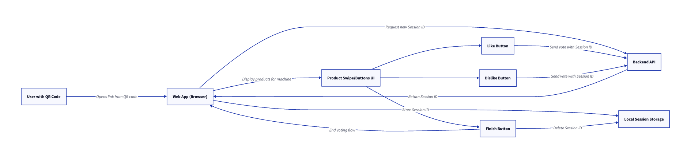
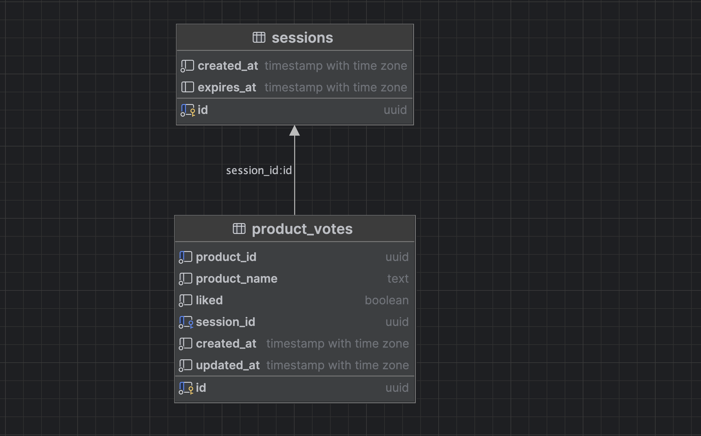
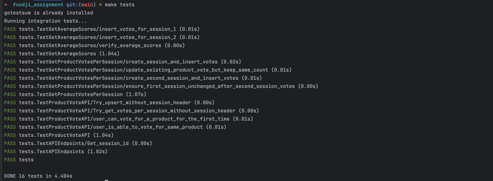

[](https://coveralls.io/github/MuhammedSami/food_tinder)
# Food Tinder

This backend is designed to support a lightweight, anonymous, swipe-based product voting experience that is intended to collect feedback on available food items.

## How users access the voting flow

- Users are shown a QR code or given a link via which they can be redirected to a web-app.

## Usage Scenario

- We want to receive feedbacks for the foods we provide, and we decide on tinder like pool for the foods.
- Instead of requiring accounts or authentication, the user provides feedback anonymously through a simple swipe or button(like/unlike) interaction.
- As we know the list of vote might be long, we provide a button to the user to finish the voting.

## Voting flow diagram


## Proposed DB Schema


### Start required services

```
make up
```

### Run migration files
````
make migrate
````

### Run the app
````
make run
````

### Run tests

The backend app contains only integration tests which gives the possibility to have a higher coverage

````
make tests
````



## OpenAPI Documentation
You can find swagger.yaml under /docs

Run the following command to have swagger container
````
make swagger-ui
````

## Deployment

The backend APP is deployed on AWS EC2 instance on the following IP

```
http://13.60.225.102/
```